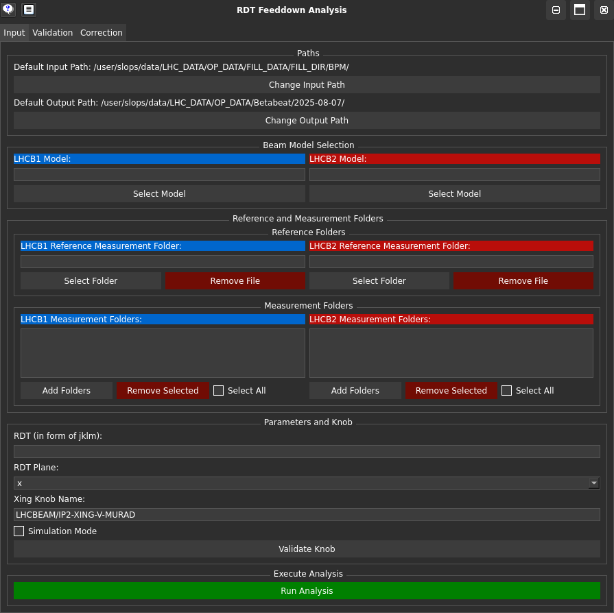

Input
=====

The :tab:`Input` tab of the GUI provides an interface to input data for the RDTfeeddown analysis. 

You can load measurement folders, reference data, and crossing angle knob data directly through the GUI.

When the analysis is run, a file is outputted, containing the RDT values and the corresponding knob values in a format suitable for further analysis or validation.

Default Input/Output Directories
--------------------------------

To set up default input and output directories, create a configuration file named ``rdtfeeddown_default.json`` (in the current working directory where you will launch the GUI from) with the following structure:

.. code-block:: json

   {
     "default_input_path": "[insert input path here]",
     "default_output_path": "[insert output path here]"
   }

Otherwise, these can be set in this tab of the GUI.

Providing Input to the RDTfeeddown GUI
--------------------------------------

You can provide input to the RDTfeeddown GUI using the following methods:

1. **File Input**:  
   Load input files by clicking the relevant button in the GUI and selecting the appropriate file.

2. **Manual Input**:  
   Manually enter file paths in the provided fields within the GUI (except for measurement folders).

.. warning:: 
  
  All folder inputs should be in the form used for the results of measurements in the `OMC analysis tools <https://pylhc.github.io/packages/omc3/about.html>`_.

Input Fields Explained
----------------------

- **Model**:  
  Requires any model folder generated by the `OMC tools <https://pylhc.github.io/packages/omc3/about.html>`_. Its only purpose is to provide the list of BPMs to look at.

- **Reference Measurement Folder**:  
  The measurement folder that contains the reference data.

- **Measurement Folders**:  
  Folders containing the data you want to compare with the reference measurement.

Simulation Mode
---------------

**Simulation Mode**: Allows you to use simulation data when no crossing angle knob data is available from ``Timber``. In this case, the GUI will not attempt to load any crossing angle knob data from ``Timber`` and will only use the provided properties file.

Properties File
---------------

The **Properties File** is a CSV file that contains the crossing angles used in the model.  
It should have the following structure:

.. raw:: html

   

     MATCH, KNOB
   

  

  Where MATCH is the name of the measurement folder, and KNOB is the value of the crossing angle knob for that measurement.
  

Running the Analysis
--------------------

:guilabel:`Run Analysis`: Runs the analysis on the provided data (i.e. collating crossing angle knob values and the RDT values), and displays the output files in the GUI on the :tab:`Validation <validation.html>` tab.

Other Features
--------------

- :guilabel:`Validate Knob`:  
  Not required unless you want to check that the crossing angle knob name exists in the ``Timber`` database for the measurement.
