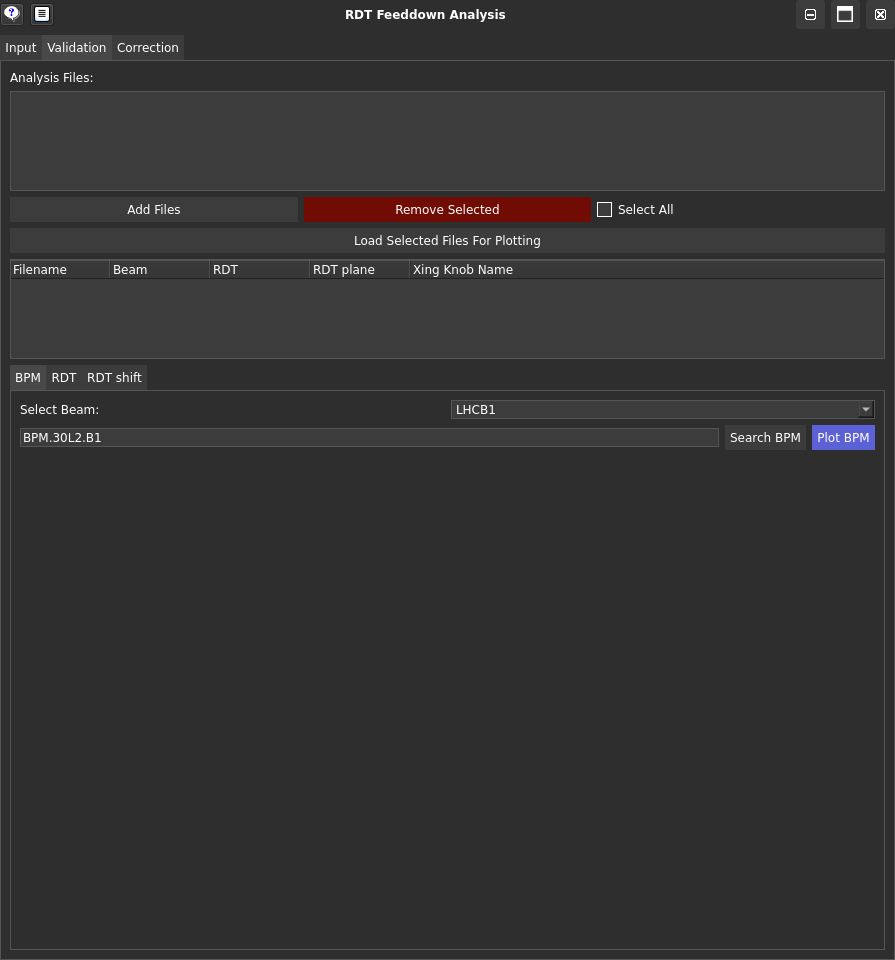

Validation
===========

The **Validation tab** of the GUI provides a user-friendly interface to validate and correct the RDT feeddown data.

You can load your data, and display it to validate it.

Input Fields Explained
---------------------

- **Add Files**:
  Add the generated files from the :ref:`Input` tab of the GUI containing the RDT feeddown data you want to plot (this simply adds the filenames to a list).

- **Load Selected Files for Plotting**:
  Load the selected files to display their data in the plotting tabs (this then checks that the files are compatible to be plotted together). The loaded files will be displayed in the box belowt the button.
  
Plotting Tabs Explained
----------------------

- **BPM**:
  This tab displays the RDT as a function of crossing angle for a BPM of your choice.

.. note::
  You can search for a BPM by typing its name in the search box - this just checks if the BPM exists in the list of BPMs. The `Plot BPM` button will plot the RDT as a function of crossing angle.

- **RDT**:
  This tab displays the RDT as a function of position s for all crossing angles.

- **RDT shift**:
  This tab displays the average RDT shift as a function of crossing angle.
